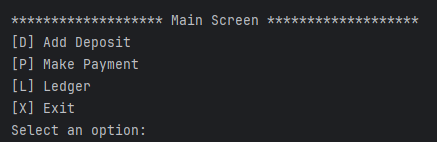
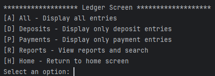
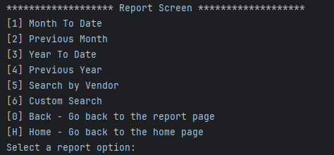
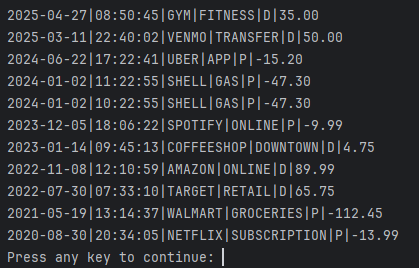
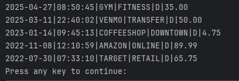
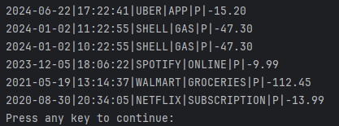

# Accounting Ledger CLI Application

This is a command-line application built in Java that allows users to track financial transactions for personal or business use. It's the first capstone project for the Java Development Fundamentals course and a great starting point for showcasing Java skills in a real-world context.

## 📌 Project Overview
The Accounting Ledger CLI app is designed to help users easily add deposits, make payments, and view a running ledger of transactions. All data is stored in a `.csv` file to keep things simple and portable. The interface is entirely menu-driven and runs in the terminal.

---

### 🖼️ Screenshots

#### 1. **Home Screen**


#### 2. **Ledger Screen**


#### 4. **Reports Section**


#### 3. **Ledger All Transactions View**


#### 3. **Ledger All Deposits View**


#### 3. **Ledger All Payments View**


## 📊 Project Status

- Work in progress. See [TODO.md](TODO.md) for planned features and development progress.
- For detailed tracking, check the [Project Board](https://github.com/users/paulofranklins2/projects/2/views/1) for the full process.

## 💡 Features

- **Add Deposits and Payments**  
  Users can log new transactions with details like date, time, description, vendor, and amount.

- **Ledger View**  
  The application shows all transactions in reverse chronological order and can filter by deposits or payments.

- **Reports**  
  Built-in reports include Month-to-Date, Previous Month, Year-to-Date, and Previous Year summaries, as well as vendor-specific searches.

- **Optional: Custom Search**  
  For those who want more control, there's also a custom search where users can filter by date range, vendor, description, and amount.

## 💡 Interesting Snippet

I find this piece of code interesting because, since I need so many inputs from the users, it avoids having to manually handle each case. With this method, I can simply call it wherever needed and it takes care of the validation and user prompt automatically.

```java
    public static String stringInput(String input) {
        while (true) {
            try {
                System.out.print(input);
                return scanner.nextLine();
            } catch (Exception e) {
                System.out.println("Invalid input. Please try again.");
            }
        }
    }
```

## 🛠️ Technologies Used

- Java
- Command Line Interface (CLI)
- CSV file for storage

## 🚀 Project Goals

This project focuses on reinforcing Java fundamentals like file I/O, loops, conditionals, object-oriented design, and user input handling. It's also an opportunity to follow basic software development practices such as version control and project organization.

## 🎯 What's Next

The plan is to continue improving the application by refining the user experience and possibly adding more robust data validation or a graphical interface in future versions.

## 🙌 Final Notes

This project was a fun and practical way to apply core Java concepts. It’s meant to be a foundation for more complex applications to come — and a portfolio piece that highlights my journey in becoming a Java developer.
