# Accounting Ledger CLI Application

This is a command-line application built in Java that allows users to track financial transactions for personal or business use. It's the first capstone project for the Java Development Fundamentals course and a great starting point for showcasing Java skills in a real-world context.

## 📌 Project Overview
The Accounting Ledger CLI app is designed to help users easily add deposits, make payments, and view a running ledger of transactions. All data is stored in a `.csv` file to keep things simple and portable. The interface is entirely menu-driven and runs in the terminal.

---

### 🖼️ Screenshots

#### 1. **CLI Main Screen**

```text
******************* Main Screen *******************
[D] Add Deposit
[P] Make Payment
[L] Ledger
[X] Exit

Select an option:
```

#### 2. **Ledger Screen**

```text
******************* Ledger Screen *******************
[A] All - Display all entries
[D] Deposits - Display only deposit entries
[P] Payments - Display only payment entries
[R] Reports - View reports and search
[H] Home - Return to home screen

Select an option:
```

#### 4. **Reports Section**

```text
******************* Report Screen *******************
[1] Month To Date
[2] Previous Month
[3] Year To Date
[4] Previous Year
[5] Search by Vendor
[6] Custom Search
[0] Back - Go back to the report page
[H] Home - Go back to the home page

Select a report option:
```

#### 3. **Sample all Transactions Screen**

```text
2025-04-27|08:50:45|GYM|FITNESS|D|35.00
2025-03-11|22:40:02|VENMO|TRANSFER|D|50.00
2024-06-22|17:22:41|UBER|APP|P|-15.20
2024-01-02|11:22:55|SHELL|GAS|P|-47.30
2024-01-02|10:22:55|SHELL|GAS|P|-47.30
2023-12-05|18:06:22|SPOTIFY|ONLINE|P|-9.99
2023-01-14|09:45:13|COFFEESHOP|DOWNTOWN|D|4.75
2022-11-08|12:10:59|AMAZON|ONLINE|D|89.99
2022-07-30|07:33:10|TARGET|RETAIL|D|65.75
2021-05-19|13:14:37|WALMART|GROCERIES|P|-112.45
2020-08-30|20:34:05|NETFLIX|SUBSCRIPTION|P|-13.99

Press ENTER to continue: 
```

#### 3. **Sample All Deposits View**

```text
2025-04-27|08:50:45|GYM|FITNESS|D|35.00
2025-03-11|22:40:02|VENMO|TRANSFER|D|50.00
2023-01-14|09:45:13|COFFEESHOP|DOWNTOWN|D|4.75
2022-11-08|12:10:59|AMAZON|ONLINE|D|89.99
2022-07-30|07:33:10|TARGET|RETAIL|D|65.75

Press ENTER to continue:
```

#### 3. **Sample All Payments View**

```text
2024-06-22|17:22:41|UBER|APP|P|-15.20
2024-01-02|11:22:55|SHELL|GAS|P|-47.30
2024-01-02|10:22:55|SHELL|GAS|P|-47.30
2023-12-05|18:06:22|SPOTIFY|ONLINE|P|-9.99
2021-05-19|13:14:37|WALMART|GROCERIES|P|-112.45
2020-08-30|20:34:05|NETFLIX|SUBSCRIPTION|P|-13.99

Press ENTER to continue:
```

## 🖼️ Screen Flow Diagram

```mermaid
flowchart TD
%% Define style for nodes
  classDef homeScreen fill:#000,stroke:#333,stroke-width:2px;
  classDef ledgerScreen fill:#000,stroke:#333,stroke-width:2px;
  classDef reportScreen fill:#000,stroke:#333,stroke-width:2px;
  classDef actionScreen fill:#325863,stroke:#333,stroke-width:2px;
  classDef exitScreen fill:#FF0000,stroke:#333,stroke-width:2px;

%% Home screen
  A[Home Screen] -->|D Add Deposit| B[Add Deposit Screen]
A -->|P Make Payment| C[Make Payment Screen]
A -->|L Ledger| D[Ledger View]
A -->|X Exit| E[Exit Application]
class A homeScreen;

%% Ledger screen options
D -->|A All Transactions| F[Show All Transactions]
D -->|D Deposits| G[Show Deposits]
D -->|P Payments| H[Show Payments]
D -->|R Reports| I[Reports Screen]
class D ledgerScreen;

%% Report screen options
I -->|1 Month To Date| J[Month To Date Report]
I -->|2 Previous Month| K[Previous Month Report]
I -->|3 Year To Date| L[Year To Date Report]
I -->|4 Previous Year| M[Previous Year Report]
I -->|5 Search by Vendor| N[Search by Vendor]
I -->|6 Custom Search| O[Custom Search]
I -->|0 Back| D
class I reportScreen;

%% Action screens (Add Deposit, Make Payment)
B -->|Press Enter to Continue| A
C -->|Press Enter to Continue| A
F -->|Press Enter to Continue| D
G -->|Press Enter to Continue| D
H -->|Press Enter to Continue| D
J -->|Press Enter to Continue| I
K -->|Press Enter to Continue| I
L -->|Press Enter to Continue| I
M -->|Press Enter to Continue| I
N -->|Press Enter to Continue| I
O -->|Press Enter to Continue| I
class B,C,F,G,H,J,K,L,M,N,O actionScreen;

%% Exit screen
E -->|Application Exits| F[End]
class E exitScreen;
```



## 📊 Project Status

- Work in progress. See [TODO.md](TODO.md) for planned features and development progress.
- For detailed tracking, check the [Project Board](https://github.com/users/paulofranklins2/projects/2/views/1) for the full process.

## 💡 Features

- **Add Deposits and Payments**  
  Users can log new transactions with details like date, time, description, vendor, and amount.

- **Ledger View**  
  The application shows all transactions in reverse chronological order and can filter by deposits or payments.

- **Reports**  
  Built-in reports include Month-to-Date, Previous Month, Year-to-Date, and Previous Year summaries, as well as vendor-specific searches.

- **Optional: Custom Search**  
  For those who want more control, there's also a custom search where users can filter by date range, vendor, description, and amount.

## 💡 Interesting Snippet

I find this piece of code interesting because, since I need so many inputs from the users, it avoids having to manually handle each case. With this method, I can simply call it wherever needed and it takes care of the validation and user prompt automatically.

```java
    public static String stringInput(String input) {
        while (true) {
            try {
                System.out.print(input);
                return scanner.nextLine();
            } catch (Exception e) {
                System.out.println("Invalid input. Please try again.");
            }
        }
    }
```

## 🛠️ Technologies Used

- Java
- Command Line Interface (CLI)
- CSV file for storage

## 🚀 Project Goals

This project focuses on reinforcing Java fundamentals like file I/O, loops, conditionals, object-oriented design, and user input handling. It's also an opportunity to follow basic software development practices such as version control and project organization.

## 🎯 What's Next

The plan is to continue improving the application by refining the user experience and possibly adding more robust data validation or a graphical interface in future versions.

## 🙌 Final Notes

This project was a fun and practical way to apply core Java concepts. It’s meant to be a foundation for more complex applications to come — and a portfolio piece that highlights my journey in becoming a Java developer.
